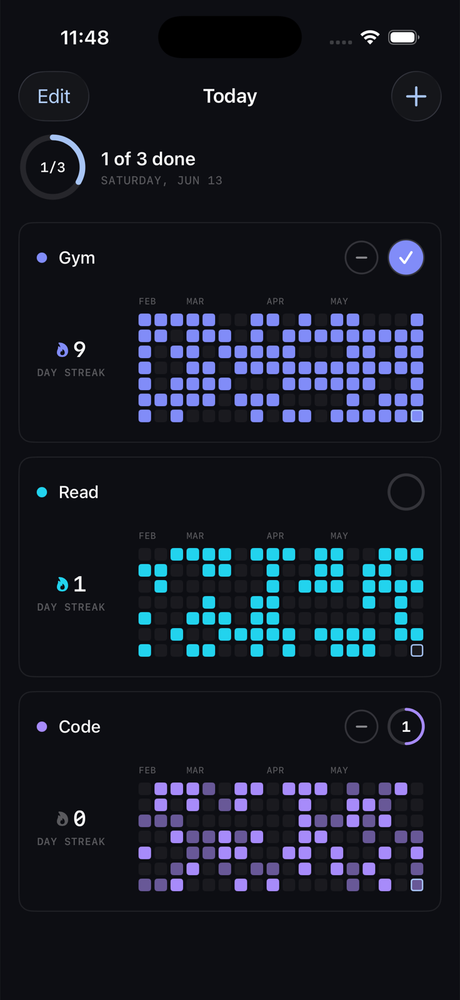
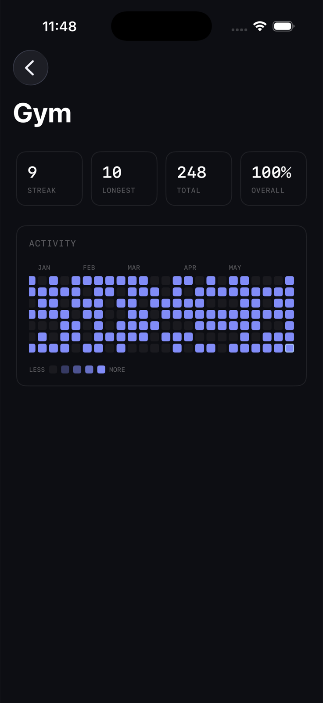
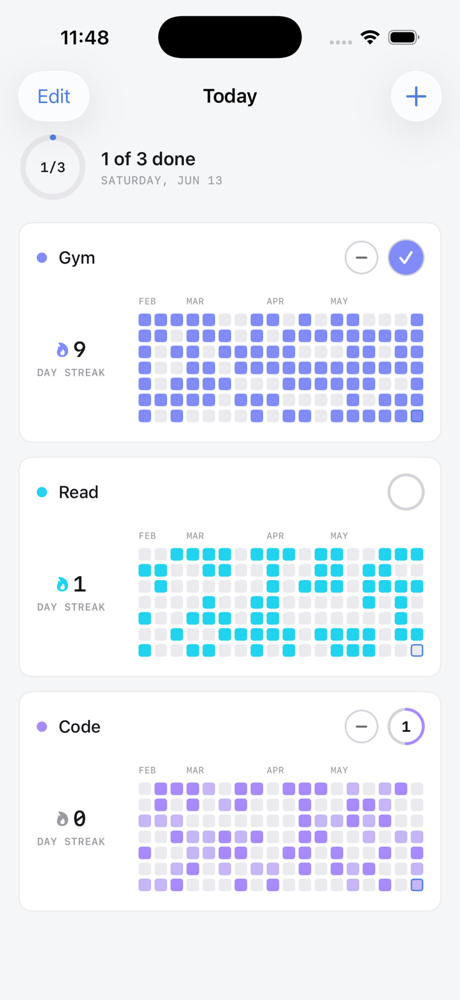
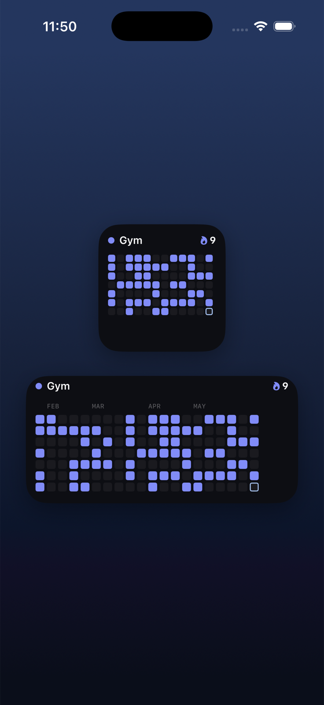

# HabitGrid

A personal iOS habit tracker I built for myself to see my daily habits as a
GitHub-style contribution grid, and to learn native iOS development (Swift, SwiftUI,
SwiftData, WidgetKit) properly along the way.

Everything lives on-device. No accounts, no servers, no analytics, just my habits and a
home-screen widget that keeps the grid in front of me.

<p align="center">
  
  
  
</p>

## The home-screen widget

The original goal: a GitHub-style grid on my home screen. The widget is **configurable** —
each placed instance shows one habit (long-press → Edit Widget → pick it), so I can stack a
few. Tapping one deep-links straight into that habit. It refreshes as soon as I log.

<p align="center">
  
</p>

## What it does

- **A contribution grid per habit** — intensity scales to that habit's daily goal, so hitting
  your target is the darkest square.
- **Count-based logging with daily targets** — some habits are once-a-day; some I want to do
  more (e.g. *two* 3-hour coding sessions). Tap to add, "−" to remove.
- **Streaks & consistency** — current streak, longest streak, and overall % of days I've hit
  the goal since I started the habit.
- **Make it mine** — add / edit / delete / reorder habits, each with a custom color (hex picker).
- **Calm, near-monochrome design** in light and dark, with a mono type system for the numbers.
- **On-device storage** (SwiftData). iCloud sync is wired and documented, ready to switch on.

## How it's built

- **SwiftUI** app · **SwiftData** persistence · **WidgetKit** + **App Intents** widget.
- **`HabitCore`** — a pure Swift package (no UI, no database) holding the interesting logic: the
  contribution-grid layout, intensity levels, and streak/consistency math. It's **unit-tested**
  (17 tests) and shared by both the app and the widget.
- **App Group** shared store so the widget reads the same data as the app.
- The Xcode project is generated from `project.yml` with **xcodegen**.

```
HabitGrid/
├── Packages/HabitCore/   # pure, tested logic (grid + streaks) — no Apple UI/DB frameworks
├── Shared/               # models, shared store, grid view, design tokens (app + widget)
├── App/                  # the SwiftUI app
├── Widget/               # the WidgetKit extension (configurable via App Intents)
└── project.yml           # xcodegen spec → HabitGrid.xcodeproj
```

## Running it

Requires macOS + **Xcode 26+**.

```sh
brew install xcodegen          # one-time
xcodegen generate              # creates HabitGrid.xcodeproj from project.yml
open HabitGrid.xcodeproj        # then Run on an iOS simulator
```

Run the logic tests:

```sh
swift test --package-path Packages/HabitCore
```

## License

MIT — see [LICENSE](LICENSE). © 2026 Mohamed Elhussiny.
